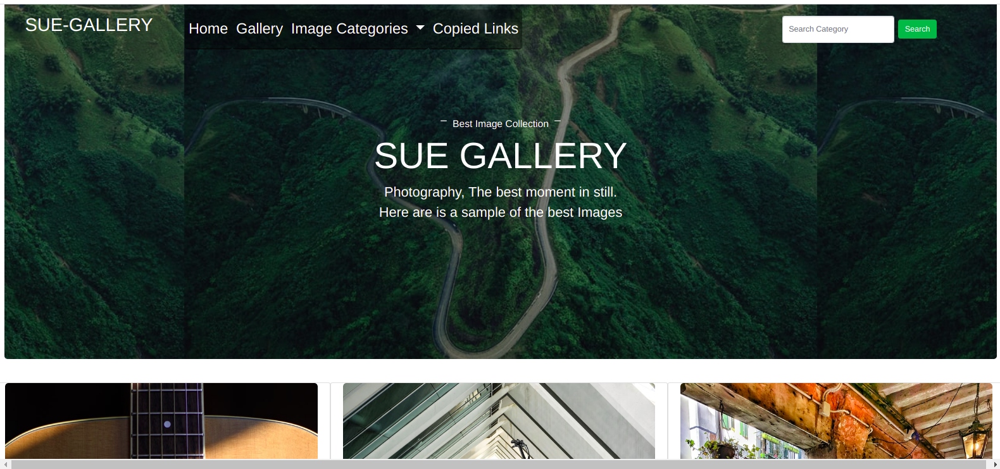

# Rudimental_blog
This is a blog website that allows an admin to add images, title and description to the website via an admin panel. The images are then categorised into locations and group categories through which they can be filtered.

A user can view image details by clicking on the image. More images are shown on the gallery's page. Image categories allow a user to know what categories are available and location buttons allow a user to filter using locations.

Future releases to enable a user to create account and see their profile on what images the liked thus implementing user roles.

# User journey.
A user visits the site. 
|_A user sees sample of images on Homepage. 
|_A user visits Gallery page where all images are shown
  |__A user filters using location.
  |_A user selects an image to see its details.
  |__A user searches for a category
  |-A user exists page

# Features to add
liking images and commenting on them

# Output
A user selects a an image and can see its details.

A searches for image categories

# Homepage

# Gallery pages

# Search results page

# Single Image

# Location Buttons

# Installation
For correct version requirements installation, check the requirements.txt

Have Python installed in you machine.- the version used for this project is 3.8.5

install pip

install and activate virtual environment

install flask in the virtual environment < version used flask1.0.2 >

Use git, Github and any editor or IDE to see the codes and the rendered frontend.

The execution is done in terminal. Either computer Terminal or IDE terminal

# Usage
Ensure you have Python installed in your machine. Clone this github repository, git pull to your local machine and code away.

# Contributing
Pull requests are welcome. For major changes, please open an issue first to discuss what you would like to change.

Please make sure to update tests as appropriate.

# Website's link
This aplication is hosted heroku. Website Link is https://mpersonalgallery.herokuapp.com/

# License
This Website uses MIT LICENSE. For more Read License.

Copyright (c) 2021 Caleb Odinga